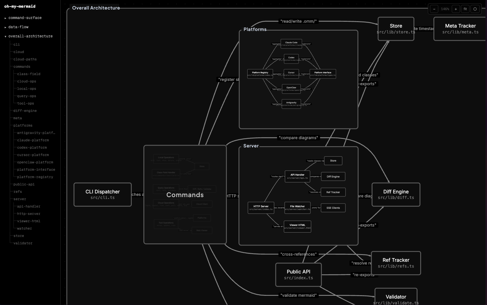

# oh-my-mermaid (omm)

[](https://www.npmjs.com/package/oh-my-mermaid)
[](./LICENSE)

**Turn complex codebases into clear, navigable architecture diagrams with AI coding tools.**

> `omm setup` → `/omm-scan` → done. Your architecture docs write themselves.

<video src="https://github.com/user-attachments/assets/2de6c496-b9a6-4734-8059-282ab130c1bc" width="100%" autoplay loop muted playsinline></video>



## Why?

Plain Mermaid diagrams are flat — one file, one diagram, no connections between them.

omm structures your architecture as **interconnected classes** that you can drill into. Use `@class-name` references to nest diagrams inside each other, zoom out to see the full picture, or click into a subsystem to focus on the details. Each class carries not just a diagram, but also context, constraints, and concerns — so the *why* behind your architecture lives right next to the *what*.

Your AI coding tool does the heavy lifting: it analyzes your code and generates everything automatically.

```
Your code → AI analyzes → .omm/ stores diagrams → Live viewer in browser
```

## Prerequisites

- [Node.js](https://nodejs.org/) 18+
- An AI coding tool: [Claude Code](https://docs.anthropic.com/en/docs/claude-code), [Codex](https://github.com/openai/codex), [Cursor](https://cursor.sh/), or [Antigravity](https://github.com/ArcadeAI/antigravity)

## Install

```bash
npm install -g oh-my-mermaid
omm setup
```

`omm setup` auto-detects installed AI coding tools and registers the `/omm-scan` skill for each. Run `omm setup --list` to see what was detected.

## Quick Start

```bash
# 1. Install
npm install -g oh-my-mermaid && omm setup

# 2. Open your AI coding tool in a project
cd your-project
claude   # or codex, cursor, etc.

# 3. Scan your architecture
/omm-scan

# 4. View in browser
omm view
# → http://localhost:3000
```

`/omm-scan` analyzes your code and generates architecture docs in the `.omm/` directory.
To focus on a specific area, pass a topic: `/omm-scan auth flow`.

## How It Works

### The `.omm/` directory

omm creates an `.omm/` directory at your project root. Each architectural unit ("class") gets its own folder with up to 7 documentation fields:

```
.omm/
├── config.yaml
├── overall-architecture/
│   ├── description.md      # What this diagram represents
│   ├── diagram.mmd         # Mermaid flowchart code
│   ├── context.md          # Why this architecture exists
│   ├── constraint.md       # Rules that must be followed
│   ├── concern.md          # Risks, tech debt, known issues
│   ├── todo.md             # Planned improvements
│   ├── note.md             # Additional notes
│   └── meta.yaml           # Auto-managed (timestamps, git info)
├── auth-flow/
│   └── ...
└── data-pipeline/
    └── ...
```

### Cross-references

Use `@class-name` in diagram nodes to link between classes:

```text
graph LR
    Client -->|"HTTP"| @auth-flow[Auth Service]
    Client -->|"WebSocket"| @data-pipeline[Data Pipeline]
```

Click `@auth-flow` in the viewer to navigate to that class.

## CLI Commands

### Basics

```bash
omm setup                     # Register skills with detected AI tools
omm setup --list              # Show detected platforms and status
omm list                      # List all classes
omm show <class>              # Display all fields for a class
omm status                    # Overview of all classes
omm delete <class>            # Delete a class
```

### Read / Write fields

```bash
omm <class> <field>           # Read a field
omm <class> <field> "content" # Write to a field
omm <class> <field> -         # Write from stdin (multiline)
```

Available fields: `description`, `diagram`, `context`, `constraint`, `concern`, `todo`, `note`

### Analysis

```bash
omm diff <class>              # Compare current vs previous diagram
omm refs <class>              # Show classes that reference this one
omm refs --reverse <class>    # Show classes this one references
```

### Local viewer

```bash
omm view                    # Start live viewer at http://localhost:3000
omm view --port 8080        # Custom port
```

Auto-refreshes in the browser when files change (via SSE).

## Cloud

Share your architecture with your team via [ohmymermaid.com](https://ohmymermaid.com).

```bash
omm login                    # Sign in (opens browser)
omm link                     # Link project to cloud
omm push                     # Upload to cloud
omm share                    # Print shareable URL

omm pull                     # Download from cloud
omm logout                   # Sign out
```

Or use `/omm-push` inside Claude Code to handle login, link, and push in one step.

## AI Coding Tool Skills

| Skill | Description |
|-------|-------------|
| `/omm-scan` | Analyze full codebase → auto-generate architecture docs |
| `/omm-scan [topic]` | Focus on a specific area (e.g. `/omm-scan auth flow`) |
| `/omm-push` | Login + link + push to cloud in one step |

### Supported Platforms

| Platform | Status | Setup method |
|----------|--------|--------------|
| Claude Code | Supported | Plugin marketplace registration |
| Codex | Supported | Symlink to `~/.agents/skills/` |
| Cursor | Supported | `.cursor-plugin/` auto-discovery |
| OpenClaw | Supported | Symlink to `~/.openclaw/skills/` |
| Antigravity | Supported | Symlink to `~/.gemini/antigravity/skills/` |

## Development

```bash
git clone https://github.com/oh-my-mermaid/oh-my-mermaid.git
cd oh-my-mermaid
npm install
npm run build

# Watch mode
npm run dev

# Test
npm test
```

## Contributing

Issues and PRs are welcome.

1. Fork → branch → change → PR
2. Use [Conventional Commits](https://www.conventionalcommits.org/) for commit messages

## License

[MIT](./LICENSE)
